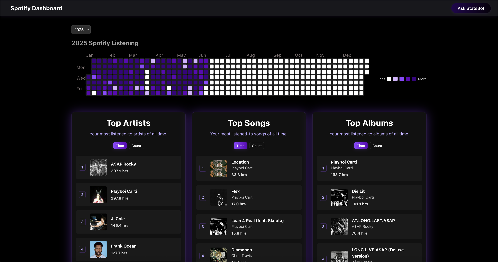
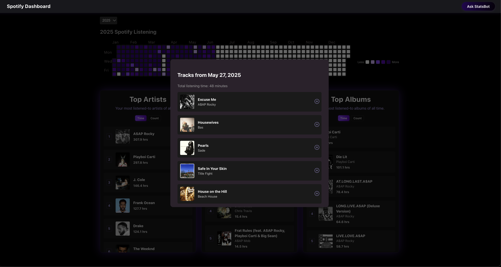
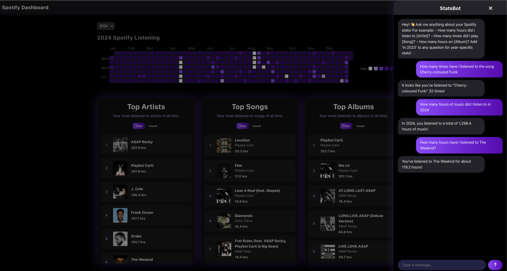

# Spotify Dashboard

An interactive dashboard that visualizes your Spotify listening history and provides an AI-powered chatbot to answer questions about your music habits.

## Features

- 📊 Interactive heatmap showing daily listening activity
- 🎵 Track list view + Minutes listened for any selected day
- 🤖 AI-powered chatbot to answer questions about your listening habits
- 📈 All-time statistics and insights

## Screenshots

### Initial Upload


### Home Page



### Track List Modal



### StatsBot



## Prerequisites

- Node.js (v14 or higher)
- Python 3.8 or higher
- Extended Spotify Streaming History  
  (You must request and download this folder from your Spotify account’s [Privacy Settings](https://www.spotify.com/account/privacy/) before uploading.)

## Setup

1. **Clone the repository:**

   ```bash
   git clone https://github.com/navinbhat12/spotify-dashboard.git
   cd spotify-dashboard
   ```

2. **Set up the backend:**

   ```bash
   cd backend
   python -m venv venv
   source venv/bin/activate  # On Windows: venv\Scripts\activate
   pip install -r requirements.txt
   ```

3. **Set up the frontend:**

   ```bash
   cd frontend
   npm install
   ```

4. **Create a Spotify Web API app:**

   Go to the [Spotify Developer Dashboard](https://developer.spotify.com/dashboard) and:

   - Log in with your Spotify account
   - Click **"Create an App"**
   - Copy the **Client ID** and **Client Secret**

   Then, in the **root project directory**, create a `.env` file and add:

   ```env
   SPOTIFY_CLIENT_ID=your_client_id_here
   SPOTIFY_CLIENT_SECRET=your_client_secret_here
   ```

5. **Start the development servers:**

   In one terminal (backend):

   ```bash
   cd backend
   uvicorn main:app --reload --port 8000
   ```

   In another terminal (frontend):

   ```bash
   cd frontend
   npm run dev
   ```

## Usage

1. **Upload Your Data**

   - Click the "Upload Data" button
   - Select the "Extended Spotify Streaming History" folder
   - Wait for your data to process

2. **Explore Your Listening History**

   - View the heatmap for daily activity
   - Click on a day to see what you listened to
   - Hover to see total minutes

3. **Ask Questions**

   - Use the chatbot to explore your habits
   - Example prompts:
     - "How many times did I listen to [song]?"
     - "What were my top artists last year?"

## License

This project is licensed under the MIT License - see the LICENSE file for details.
