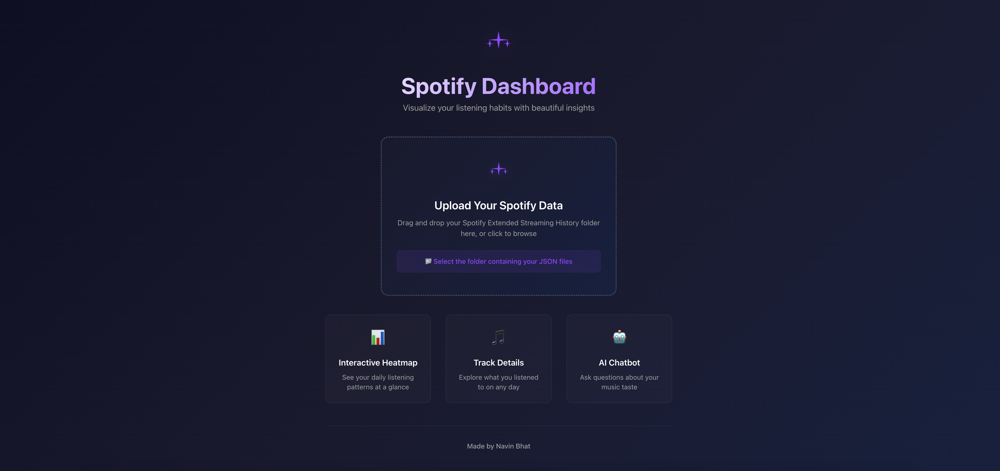
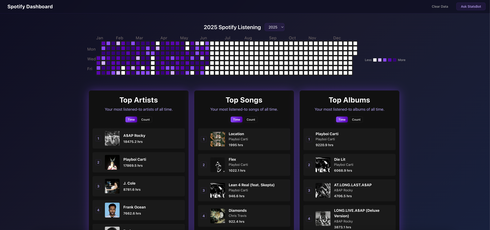
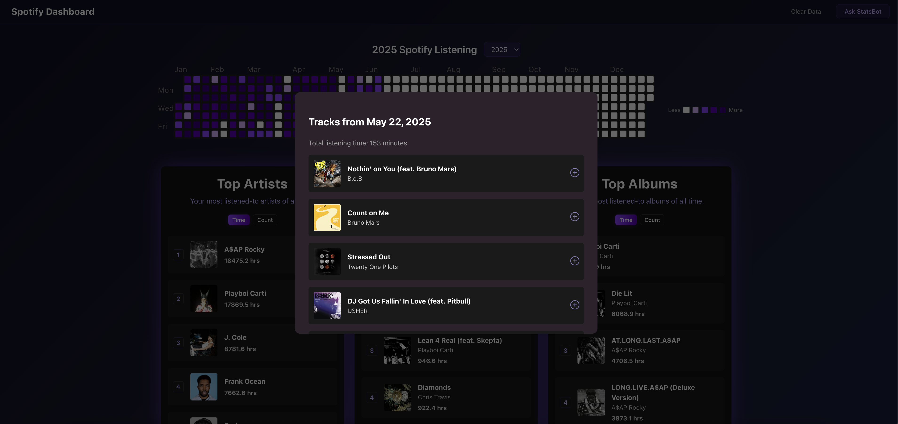
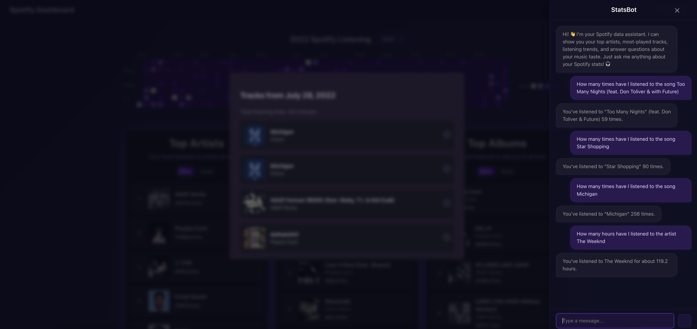

# Spotify Dashboard

An interactive dashboard that visualizes your Spotify listening history and provides an AI-powered chatbot to answer questions about your music habits.

## 🌐 Production Deployment

**[Spotify Dashboard →](https://spotify-dashboard-phi.vercel.app/)**

## Features

- **Interactive Dashboard**: Visualize your Spotify listening data with beautiful heatmaps and charts. See your daily listening patterns, track your favorite artists, and discover your most-played songs all in one place.
- **Track Details**: Click on any day to see exactly what you listened to. Explore your daily playlists, discover forgotten favorites, and relive your musical moments with detailed track information.
- **AI Chatbot Assistant**: Ask questions about your music taste in natural language. Find your top artists, most-played songs, listening trends, and get personalized insights about your Spotify journey.

## Screenshots

### Initial Upload Page

### Main Dashboard

### Track Details Modal

### AI Chatbot

## Tech Stack

### Frontend

- **React**: A JavaScript library for building user interfaces.
- **Vite**: A fast build tool that provides a quicker and leaner development experience.
- **Vercel**: A cloud platform for static sites and Serverless Functions.

### Backend

- **FastAPI**: A modern, fast (high-performance) web framework for building APIs with Python.
- **SQLAlchemy**: A SQL toolkit and Object-Relational Mapper (ORM) for Python.
- **Pandas**: A powerful data analysis and manipulation library for Python.
- **Google Cloud Run**: A fully managed compute platform that automatically scales your stateless containers.

## License

This project is licensed under the MIT License - see the LICENSE file for details.
